# 🌱 我的生命花園｜16 週兒童藝術．生命教育課程

> **適用對象**：國小一、二年級（6–8 歲）
> **課程長度**：16 週，每週 1 次，每次 2 小時（120 分鐘）
> **作品數量**：8 件，每件以 2 堂課（共 4 小時）完成
> **使用媒材**：紙黏土、兒童繪畫、押花、拼貼（可單一媒材，亦可混合媒材）
> **核心精神**：以藝術為橋樑，帶孩子走一趟「**認識自己 → 連結他人 → 擁抱自然 → 蛻變圓滿**」的生命旅程。

---

## 一、課程設計理念

這套課程不只是「教孩子做手工」，而是讓每一件作品都成為一次**生命的練習**。

小一、小二的孩子正處於「具體運思」的起點：他們透過雙手觸摸、實際操作來理解抽象的概念。因此本課程把「生命教育」中較難用語言說明的主題——例如**情緒、友誼、感恩、改變、希望**——轉化成「可以捏、可以畫、可以貼、可以聞」的具體創作經驗。

孩子在搓揉紙黏土時學會**接納不完美**；在壓乾一朵花時體會**珍惜與無常**；在和同學拼貼一幅大圖時練習**合作與包容**。藝術成為「容器」，盛裝孩子說不出口的感受；老師則是「陪伴者」，不評斷美醜，只回應生命。

### 設計三原則
1. **手作優先、語言其次**：先讓孩子動手「體驗」，再用簡單問句引導「覺察」，不說教。
2. **沒有失敗的作品**：所有「畫歪、捏破、貼錯」都被重新定義為「獨一無二的痕跡」。
3. **每件作品都能帶回家**：作品是孩子與家庭對話的媒介，延伸學習回到生活。

---

## 二、生命教育四大主軸（對應 108 課綱生命教育素養）

| 階段 | 生命教育主軸 | 對應作品 | 核心生命提問 |
|---|---|---|---|
| 第一階段 | **人與自己**——認識與接納自己 | 作品 1、2 | 我是誰？我有什麼感覺？ |
| 第二階段 | **人與他人**——愛與歸屬 | 作品 3、4 | 我和別人怎麼相處？什麼是家？ |
| 第三階段 | **人與自然**——感恩與責任 | 作品 5、6 | 大自然給了我什麼？我能保護什麼？ |
| 第四階段 | **人與生命**——蛻變與希望 | 作品 7、8 | 我會長大嗎？我想成為什麼樣的人？ |

---

## 三、16 週課程總覽表

| 週次 | 作品 | 主要媒材 | 生命教育主題 | 階段 |
|---|---|---|---|---|
| W1–W2 | **作品 1｜我的魔法小宇宙** | 兒童繪畫 | 情緒覺察・自我肯定 | 人與自己 |
| W3–W4 | **作品 2｜種子寶寶的家** | 紙黏土＋押花點綴 | 生命的起點・等待與成長 | 人與自己 |
| W5–W6 | **作品 3｜手牽手好朋友** | 拼貼（撕紙） | 友誼・合作・接納不同 | 人與他人 |
| W7–W8 | **作品 4｜我的溫暖小屋** | 紙黏土＋多媒材 | 家・愛與歸屬・安全感 | 人與他人 |
| W9–W10 | **作品 5｜大自然的禮物書籤** | 押花＋兒童繪畫 | 感恩・珍惜當下・四季 | 人與自然 |
| W11–W12 | **作品 6｜海底好朋友** | 紙黏土＋繪畫（混媒） | 愛護環境・保護生命・責任 | 人與自然 |
| W13–W14 | **作品 7｜毛毛蟲變蝴蝶** | 拼貼＋押花翅膀（混媒） | 成長蛻變・勇氣・希望 | 人與生命 |
| W15–W16 | **作品 8｜我的生命樹**（總結） | 繪畫＋紙黏土＋押花＋拼貼（全混媒） | 統整・感恩・夢想・圓滿 | 人與生命 |

> **媒材覆蓋檢核**：兒童繪畫（1、5、8）｜紙黏土（2、4、6、8）｜押花（2、5、7、8）｜拼貼（3、7、8）。四種媒材皆有「單獨運用」與「混合運用」的經驗。

---

## 四、每堂課的固定節奏（120 分鐘＝100 分鐘上課＋20 分鐘整理）

每堂課總長 2 小時（120 分鐘）：**前 100 分鐘為實際上課製作**（登陸、示範、創作、分享），**最後 20 分鐘預留給整理環境**（收拾、清潔、歸位、洗手）。為了照顧小一、小二孩子的專注力（單次約 15–20 分鐘），每堂都採用相同節奏，讓孩子有安全感、知道接下來會發生什麼。

| 時段 | 時間 | 內容 | 目的 |
|---|---|---|---|
| **① 心靈登陸** | 0–12 分 | 故事 / 心情分享圈圈 | 安定情緒、帶入生命主題 |
| **② 技法魔法** | 12–27 分 | 老師示範當天技法（簡短、誇張、好玩） | 降低門檻、建立信心 |
| **③ 沉浸創作** | 27–85 分 | 孩子動手做（中間穿插 1 次伸展休息） | 主要創作時間（約 58 分） |
| **④ 收心分享** | 85–100 分 | 圍圈分享「最喜歡的一個地方」 | 回顧、語言化生命體驗 |
| **⑤ 整理環境** | 100–120 分 | 收拾工具、清潔桌面、作品歸位、洗手 | **生命教育：為自己的空間負責、物歸原位** |

> **小提醒 1**：每件作品第 1 堂偏向「打底 / 塑形 / 探索」，第 2 堂偏向「上色 / 裝飾 / 完成 / 分享」。
> **小提醒 2**：下方各課流程中的 ①–④ 對應上表的 0–100 分鐘；第 ⑤ 段「整理環境」每堂固定保留 20 分鐘，不再重複列出。把收拾當成課程的一部分，培養孩子的責任感與秩序感。

---

# 五、八件作品完整教案

---

## 🪐 作品 1｜我的魔法小宇宙（兒童繪畫）
**週次 W1–W2｜媒材：兒童繪畫（蠟筆＋廣告顏料／水彩）｜生命主軸：人與自己**

#### 🎒 學生作品範例（小一 ／ 小二）
**小一範例**——以單一星球為主，造型簡單、用色直覺，重點在「畫出一顆有表情、屬於自己的星球」。
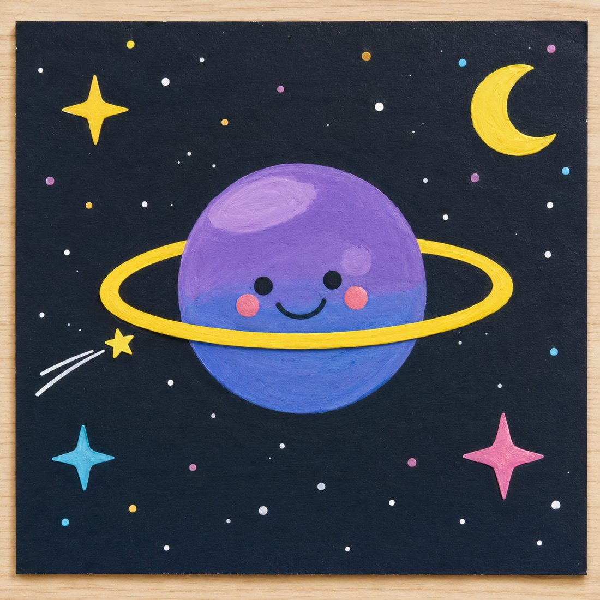
**小二範例**——加入太空人、火箭、多顆星球與流星，畫面更豐富、會說一個小宇宙的故事。
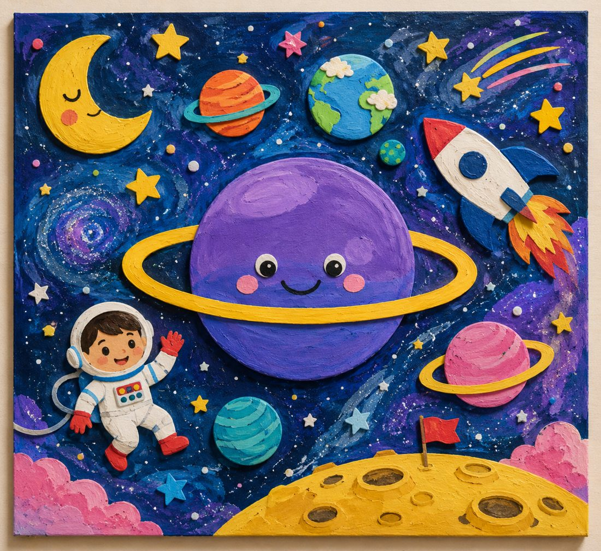

### 生命連結
**【情緒覺察與自我肯定】** 每個人心裡都住著一個專屬自己的小宇宙。引導孩子用顏色表達心情，把「自己喜歡的、在乎的」放進星球裡，明白「**我的世界，由我作主**」，建立自我認同與內在的安全感。

### 第 1 堂（上課 100 分＋整理 20 分）｜畫出我的星球
- **① 心靈登陸**：心情顏色圈——「今天你的心情是什麼顏色的星星？」每人選一支蠟筆說一句。
- **② 技法魔法**：示範「渲染星空背景」（深藍／紫的濕畫法）＋畫一顆圓圓的星球（疊色、加光環）。
- **③ 沉浸創作**：畫一顆「專屬自己的魔法星球」，星球上放自己喜歡的東西（最愛的顏色、小動物、家人…）。
- **④ 收心分享**：「你的星球上，住著什麼讓你最安心？」

### 第 2 堂（上課 100 分＋整理 20 分）｜點亮我的宇宙
- 用廣告顏料／白色點出星星、流星、光點，讓宇宙閃閃發亮。
- 為星球取一個名字，在背面寫上「我的星球叫＿＿＿，這裡的人都＿＿＿」。

### 💡 講師深度備忘錄
- **觀察重點**：注意「把星球畫得很小、孤零零」或「整片塗黑不留一點光」的孩子，可能反映自信或情緒低落。
- **對話引導**：不要只稱讚「畫得好漂亮」，要問：「住在你的星球上，是什麼感覺？」
- **生命提醒**：若孩子畫出黑暗、沒有星星的宇宙，溫柔地問：「你的宇宙現在是夜晚嗎？要不要放一顆只屬於你的小光點？」**接受所有樣子的宇宙**。
- **適齡技巧**：星球的圓可先用圓形板／杯口描出輪廓，幫助手部尚不穩定的孩子；濕畫法先鋪水再點色，享受顏色暈開的驚喜。

#### 📦 教學包補充
- **材料（每人）**：8 開水彩／圖畫紙 1、蠟筆 1 盒、廣告顏料（藍／紫／白為主）、水彩筆中小各 1、調色盤、洗筆筒、白色點點筆或牙刷（噴點星星）。**共用**：圓形描板／瓶蓋、抹布、報紙墊、吹風機（老師）。
- **作品存放與跨週銜接**：第 1 堂濕畫須**平放陰乾**，夾入個人資料夾並貼名字，避免顏料未乾互相疊壓；第 2 堂取回續畫點星。
- **回家對話小卡**：「請孩子介紹他的星球叫什麼名字、上面住著誰，哪裡讓他最安心？」

---

## 🌱 作品 2｜種子寶寶的家（紙黏土＋押花）
**週次 W3–W4｜媒材：紙黏土為主，押花點綴｜生命主軸：人與自己**

#### 🎒 學生作品範例（小一 ／ 小二）
**小一範例**——盆身造型單純，幾朵小花＋一扇小門，種子寶寶有可愛表情即可。
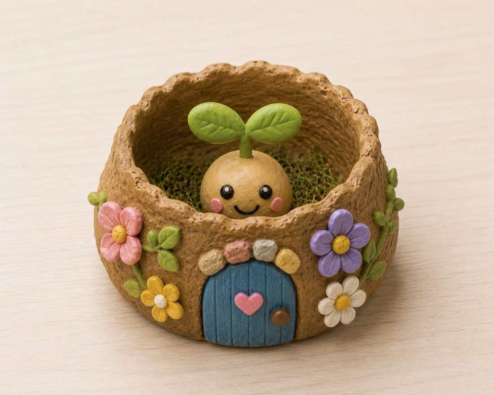
**小二範例**——加上藤蔓、石頭門框、小蘑菇與更多花葉，細節豐富、更有「家」的故事感。
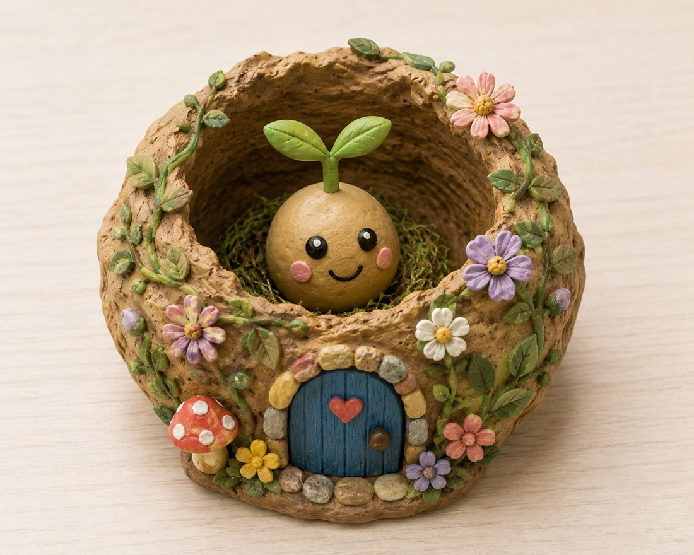

### 生命連結
**【生命的起點・等待與成長】** 每一顆種子裡都藏著一棵大樹的夢想。提升孩子「我現在雖然小，但我正在長大」的自我接納與耐心。

### 第 1 堂（上課 100 分＋整理 20 分）｜捏一個家
- **① 心靈登陸**：故事——「一顆種子的旅行」（老師口述）。
- **② 技法魔法**：示範搓圓、壓扁、捏出小巢 / 小盆的造型。
- **③ 沉浸創作**：捏一個「種子寶寶的家」（巢、盆或蛋殼狀），並捏一顆有表情的種子寶寶放進去。
- **④ 收心分享**：「你的種子寶寶在想什麼？」（陰乾一週）

### 第 2 堂（上課 100 分＋整理 20 分）｜裝飾與守護
- 乾刷上色，呈現泥土、自然的質感。
- 用**押花的小葉片、小花**裝飾家的邊緣，象徵「被自然守護」。
- 為種子寶寶取一個名字，寫在小牌子上。

### 💡 講師深度備忘錄
- **觀察重點**：孩子對「壓痕、捏歪」的反應；有些孩子求好心切會很焦慮。
- **對話引導**：當孩子覺得捏壞了，說：「這個痕跡就像種子的胎記，讓它和別人都不一樣。」
- **生命提醒**：強調「現在小小的，是因為還在長大」，呼應孩子自己的成長。
- **安全 & 適齡**：押花很脆，示範「白膠點一點、輕輕放」；紙黏土選**無毒、好搓**的款式。

#### 📦 教學包補充
- **材料（每人）**：輕質紙黏土 約 100g（米／咖／綠）、黏土工具組、牙籤、白膠、廣告／壓克力顏料（乾刷用）、平筆、押花數片、小木牌或標籤。**共用**：濕紙巾、陰乾盤、桌墊。
- **作品存放與跨週銜接**：⚠️ 第 1 堂塑形後**需陰乾約 7 天**——置於貼名字的陰乾盤、放通風處、勿日曬（以免龜裂）；第 2 堂乾後再乾刷上色與裝飾。
- **回家對話小卡**：「種子寶寶叫什麼名字？它正在等待長成什麼？可以和孩子一起種一顆真的種子觀察。」

---

## 🤝 作品 3｜手牽手好朋友（拼貼）
**週次 W5–W6｜媒材：拼貼（手撕色紙＋雜誌紙）｜生命主軸：人與他人**

#### 🎒 學生作品範例（小一 ／ 小二）
**小一範例**——兩個小人手牽手、加上太陽愛心與小花，撕貼大塊面、構圖單純清楚。
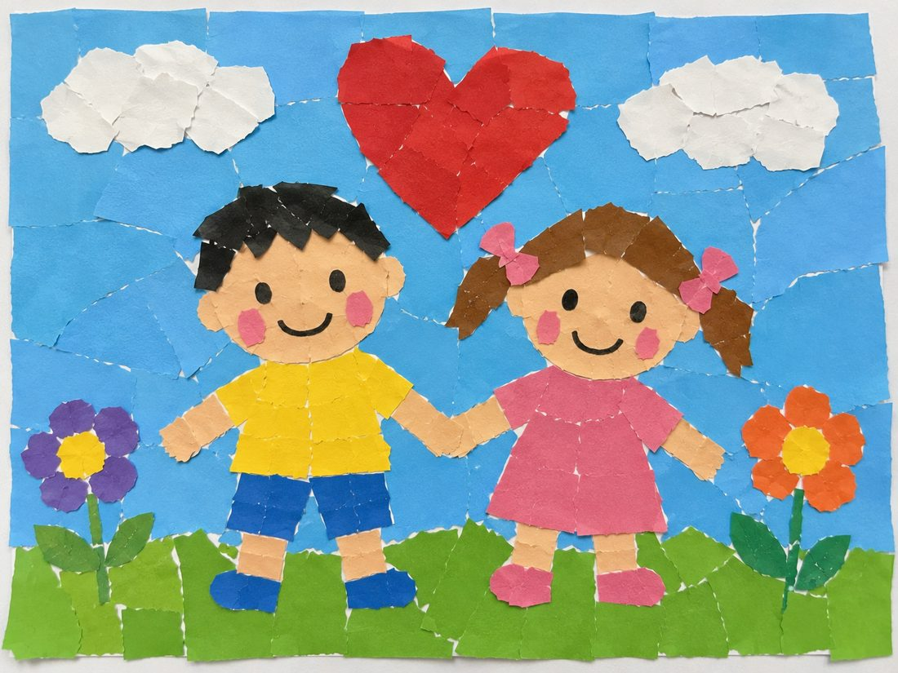
**小二範例**——五個好朋友站成一排手牽手，人物表情與衣服花色更多變，是熱鬧的「友誼鏈」。
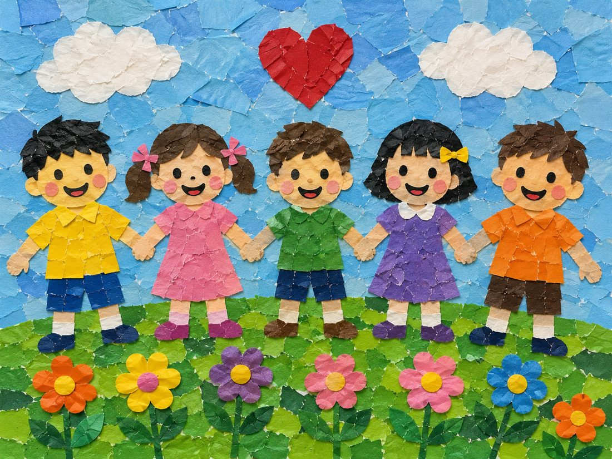

### 生命連結
**【友誼・合作・接納不同】** 不同顏色、不同形狀的紙，拼在一起更漂亮。提升孩子「每個人都不一樣，但我們可以是好朋友」的包容心。

### 第 1 堂（上課 100 分＋整理 20 分）｜撕出我的朋友
- **① 心靈登陸**：「你的好朋友長什麼樣子？哪裡和你不一樣？」
- **② 技法魔法**：示範「手指撕紙」——撕出有機毛邊的人形、頭髮、衣服。
- **③ 沉浸創作**：每人撕貼出「我」和「一個好朋友」手牽手。
- **④ 收心分享**：分享「我朋友最棒的一個地方」。

### 第 2 堂（上課 100 分＋整理 20 分）｜拼成一條友誼鏈（合作）
- 把每個人的小人**接起來**，貼成一條橫跨整面牆的「手牽手好朋友鏈」。
- 在人與人之間貼上愛心、花朵連結。

### 💡 講師深度備忘錄
- **觀察重點**：習慣用剪刀的孩子可能對「撕破」焦慮；觀察孩子願不願意把作品「接給別人」。
- **對話引導**：當孩子說「撕壞了」，回應：「太好了，這個形狀剛好可以當帽子！」
- **生命提醒**：強調「我們每個人不一樣，接在一起才變成一條完整的鏈子」——差異是力量。
- **班級經營**：合作環節先講好「不能批評別人撕得醜」的約定。

#### 📦 教學包補充
- **材料（每人）**：多色色紙、舊雜誌／廣告紙、口紅膠、白膠、8 開底紙、簽字筆。**共用**：大張壁報紙或長條牛皮紙（合作友誼鏈用）、雙面膠。
- **作品存放與跨週銜接**：第 1 堂個人小人作品平放收存；第 2 堂接成「友誼鏈」後可**捲收或貼牆保留至期末成果展**當主題牆。
- **回家對話小卡**：「請孩子說一個好朋友和他『不一樣』的地方，為什麼還是喜歡這個朋友？」

---

## 🏠 作品 4｜我的溫暖小屋（紙黏土＋多媒材）
**週次 W7–W8｜媒材：紙黏土＋小布料 / 鈕扣 / 押花（混媒）｜生命主軸：人與他人**

#### 🎒 學生作品範例（小一 ／ 小二）
**小一範例**——紅屋頂小屋＋一棵樹與柵欄，門窗與愛心清楚，結構穩固好完成。
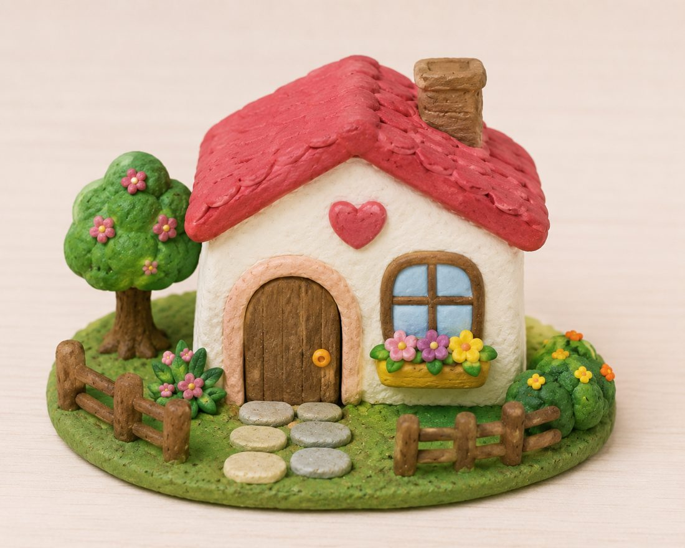
**小二範例**——加上百葉窗、爬牆藤蔓、石頭門框、信箱與更多花草，像一棟有故事的童話小屋。
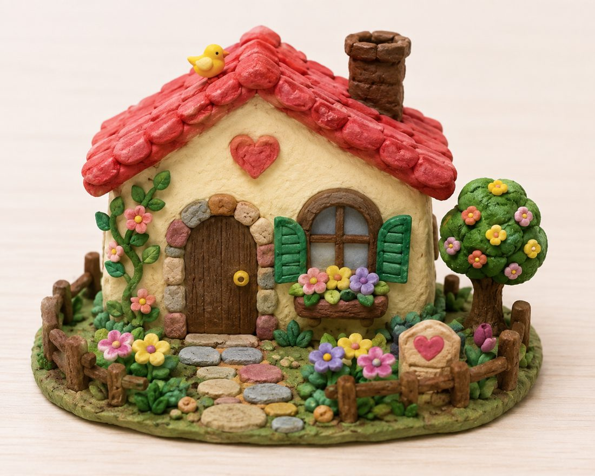

### 生命連結
**【家・愛與歸屬・安全感】** 房子是「心理的避風港」。提升孩子安放珍貴回憶、感受「我有一個被愛的地方」的安全感。

### 第 1 堂（上課 100 分＋整理 20 分）｜蓋一間小屋
- **① 心靈登陸**：「家裡，哪一個角落讓你最安心？」
- **② 技法魔法**：示範用紙黏土做牆、屋頂、門、窗（盒型結構加固）。
- **③ 沉浸創作**：搭出自己的小屋外型。
- **④ 收心分享**：「你的小屋門是開著還是關著？為什麼？」（陰乾一週）

### 第 2 堂（上課 100 分＋整理 20 分）｜佈置溫暖
- 上色，並用**鈕扣、小布、押花**裝飾門窗與花園。
- 在屋裡放一個代表「最愛的人 / 最珍貴的東西」的小物。

### 💡 講師深度備忘錄
- **觀察重點**：門窗是開放還是緊閉？屋內放具象（家人）還是抽象（顏色）？
- **對話引導**：「如果小屋會說話，它會怎麼安慰難過的你？」
- **生命提醒**：**尊重隱私**。若孩子不願說屋裡放了什麼，稱讚他：「你很會保護自己的寶物，很勇敢。」
- **安全**：鈕扣等小物注意誤食風險，全程桌面操作、用白膠固定。

#### 📦 教學包補充
- **材料（每人）**：紙黏土 約 150g、厚紙盒或底板（小屋結構）、鈕扣／小布／亮片、白膠或保麗龍膠、顏料、平筆、押花。**共用**：剪刀、熱熔槍（⚠️ 僅老師操作）。
- **作品存放與跨週銜接**：⚠️ 第 1 堂結構體積較大，塑形後**陰乾一週**，放穩固托盤、貼名字、勿堆疊；第 2 堂乾後上色與佈置。
- **回家對話小卡**：「家裡哪一個角落讓你最安心？你的小屋裡放了誰／什麼最珍貴的東西？」

---

## 🍂 作品 5｜大自然的禮物書籤（押花＋繪畫）
**週次 W9–W10｜媒材：押花為主，兒童繪畫襯底｜生命主軸：人與自然**

#### 🎒 學生作品範例（小一 ／ 小二）
**小一範例**——水彩漸層底色＋幾朵押花直式排列，搭配緞帶，簡單就很美。
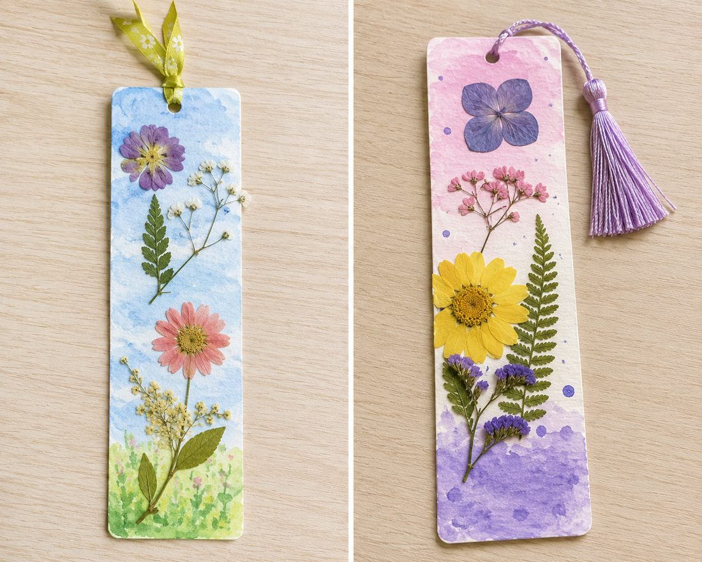
**小二範例**——花葉層次更豐富、加上流蘇與點點裝飾，構圖更講究。
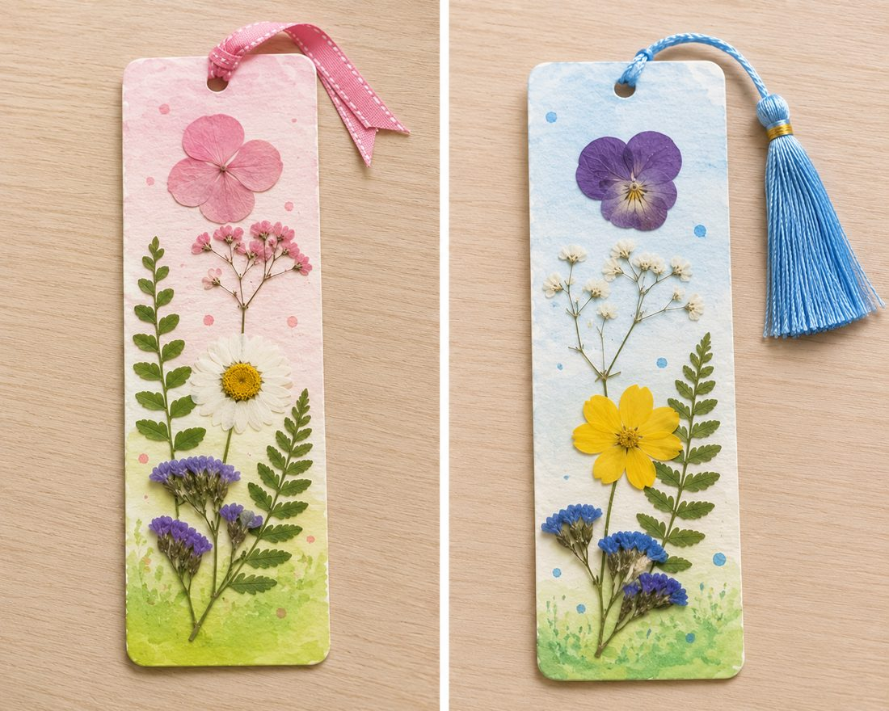

### 生命連結
**【感恩・珍惜當下・四季】** 一朵花被壓乾，把最美的樣子留下來。提升孩子「珍惜眼前、對大自然心懷感謝」的情感。

### 第 1 堂（上課 100 分＋整理 20 分）｜尋寶與壓花
- **① 心靈登陸**：戶外 / 校園「大自然尋寶」（撿落葉、小花），或用事先壓好的押花。
- **② 技法魔法**：認識押花、講解「為什麼花會變平變乾」。
- **③ 沉浸創作**：在書籤卡上用水彩 / 蠟筆畫出「我最喜歡的季節」底色。
- **④ 收心分享**：「你今天最感謝大自然的什麼？」

### 第 2 堂（上課 100 分＋整理 20 分）｜拼貼與護貝
- 在底色上排列、黏貼押花，構成一幅小風景。
- 護貝 / 貼透明膜完成書籤，穿上緞帶。

### 💡 講師深度備忘錄
- **觀察重點**：孩子排花時是「滿滿塞」還是「留白」？反映內在的節奏感。
- **對話引導**：「這朵花以前是活的，現在它換一種方式陪著你，你想對它說什麼？」
- **生命提醒**：用溫柔的方式談「無常」——花謝了不是消失，而是變成另一種美。**不必強調死亡，重點是珍惜與感謝**。
- **適齡技巧**：押花易碎，提供鑷子或棉花棒沾膠，減少手指直接接觸。

#### 📦 教學包補充
- **材料（每人）**：書籤厚卡、水彩或蠟筆、押花／押葉數片、鑷子、白膠或點膠、冷裱膜／護貝膜或寬透明膠帶、緞帶。**共用**：打孔器（老師）、戶外尋寶小袋。
- **作品存放與跨週銜接**：⚠️ **押花需於開課前 2–3 週先壓製**（或採購現成）。第 1 堂底色畫完陰乾；第 2 堂排花、護貝、穿緞帶，**當堂完成可帶回**。
- **回家對話小卡**：「今天最感謝大自然的什麼？把這張書籤送給一個你想感謝的人吧。」
- **行前提醒**：戶外尋寶需先勘查場地與安全，並備雨天室內替代方案（改用現成押花）。

---

## 🐠 作品 6｜海底好朋友（紙黏土＋繪畫｜混媒）
**週次 W11–W12｜媒材：紙黏土立體＋繪畫背景（混媒）｜生命主軸：人與自然**

#### 🎒 學生作品範例（小一 ／ 小二）
**小一範例**——藍色背景＋一隻小丑魚與海草、海星，造型大塊、單一主角清楚。
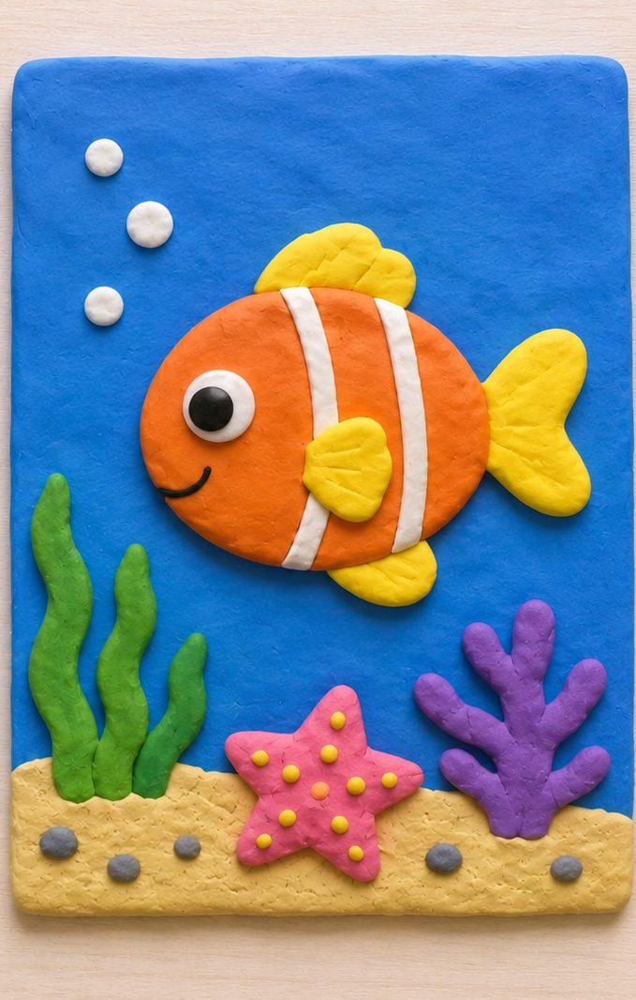
**小二範例**——海龜、鯨魚、章魚、螃蟹多種生物同場，泡泡與珊瑚細節豐富，像一座小海洋。
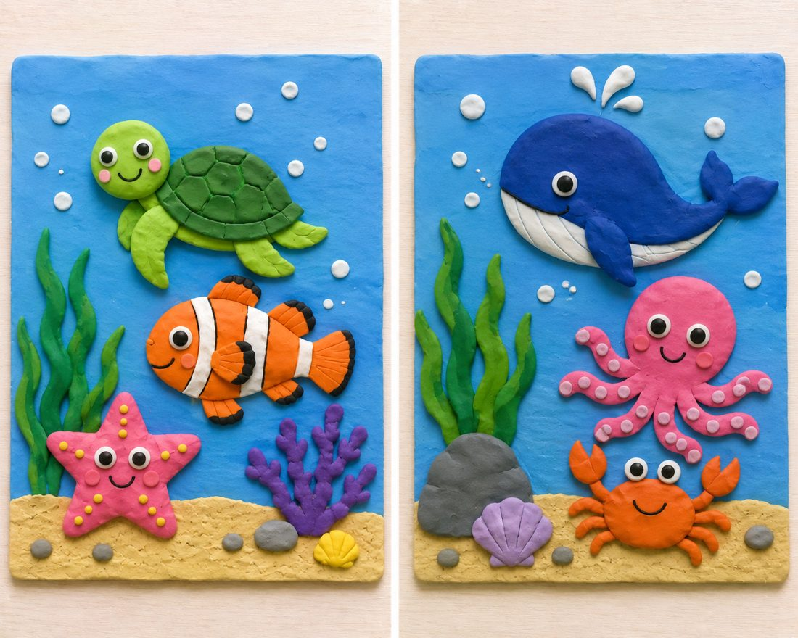

### 生命連結
**【愛護環境・保護生命・責任】** 海洋裡住著好多生命，牠們需要乾淨的家。提升孩子「我可以保護比我更小的生命」的責任感。

### 第 1 堂（上課 100 分＋整理 20 分）｜畫出海洋的家
- **① 心靈登陸**：聊聊「如果海裡都是垃圾，魚會怎樣？」
- **② 技法魔法**：示範水藍漸層背景（濕畫法）＋紙黏土搓出魚、海龜、珊瑚。
- **③ 沉浸創作**：畫海洋背景（第 1 堂主畫背景，黏土小物陰乾）。
- **④ 收心分享**：「你想保護海裡的哪一個朋友？」

### 第 2 堂（上課 100 分＋整理 20 分）｜組合與守護宣言
- 為黏土海洋生物上色，黏貼到背景上，加泡泡、海草。
- 一起說一句「我會做到的環保小事」（不亂丟、自帶水壺…）。

### 💡 講師深度備忘錄
- **觀察重點**：孩子是否願意在畫面留「乾淨的空間」給生物？
- **對話引導**：「這隻小魚迷路了，你的畫裡哪裡可以當牠安全的家？」
- **生命提醒**：把「環保」連結到「保護一個具體的小生命」，比抽象口號更打動小小孩。
- **混媒技巧**：背景紙先裱在厚卡上避免黏土把紙壓皺；黏土用白膠＋牙籤固定。

#### 📦 教學包補充
- **材料（每人）**：4 開水彩紙（裱厚卡）、藍綠系水彩、紙黏土（各色）、白膠、牙籤、泡棉膠、顏料、平筆。**共用**：吹風機（老師加速陰乾）、桌墊。
- **作品存放與跨週銜接**：⚠️ 第 1 堂背景畫與黏土小生物**分開陰乾約一週**（黏土另放貼名字的盤）；第 2 堂上色、組合、加泡泡海草。
- **回家對話小卡**：「你最想保護海裡的哪一個朋友？這一週和家人一起做一件環保小事（自帶水壺、不用吸管）。」
- **延伸**：可結合班級「減塑週」行動，把藝術連到真實生活的責任。

---

## 🦋 作品 7｜毛毛蟲變蝴蝶（拼貼＋押花翅膀｜混媒）
**週次 W13–W14｜媒材：拼貼＋押花（混媒）｜生命主軸：人與生命**

#### 🎒 學生作品範例（小一 ／ 小二）
**小一範例**——毛毛蟲、繭、蝴蝶三階段清楚呈現，蝴蝶翅膀用押花對稱拼貼。
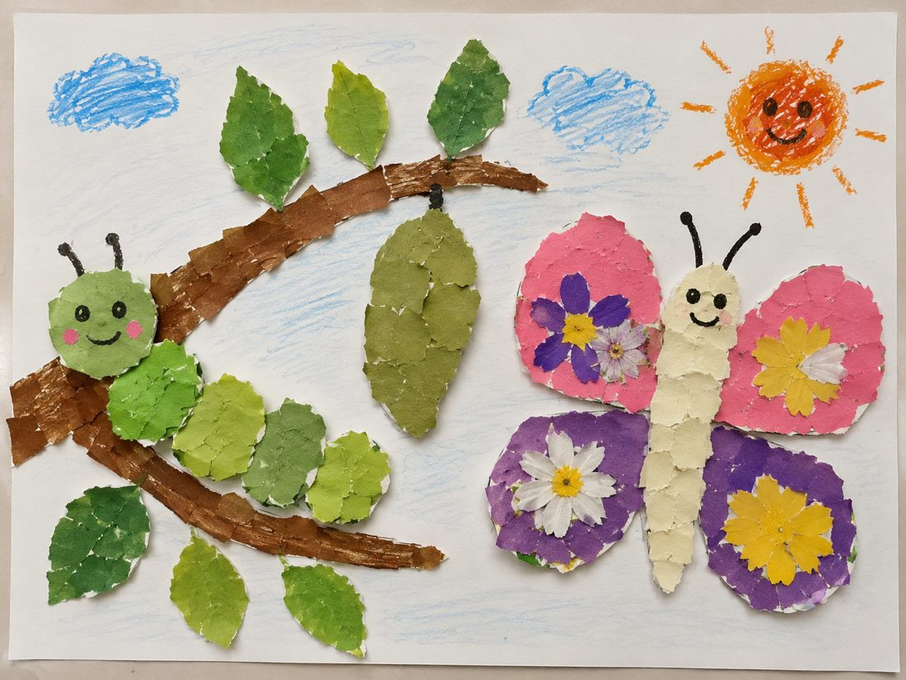
**小二範例**——加入大量花葉與草地，畫面層次更滿，蝴蝶與背景的花朵呼應更細緻。
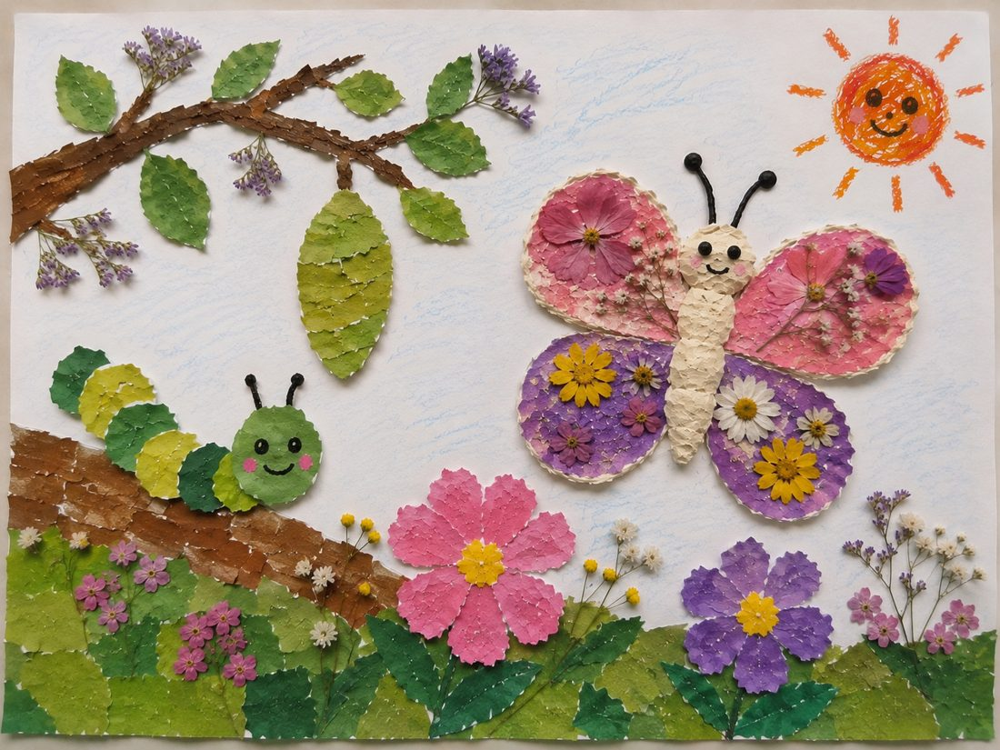

### 生命連結
**【成長蛻變・勇氣・希望】** 毛毛蟲要在黑黑的繭裡等待，才能長出翅膀。提升孩子面對「改變、等待、長大」的勇氣與盼望。

### 第 1 堂（上課 100 分＋整理 20 分）｜毛毛蟲與繭
- **① 心靈登陸**：毛毛蟲變蝴蝶的短片（或老師口述毛毛蟲長大的故事）。
- **② 技法魔法**：示範拼貼毛毛蟲（圓形色紙串接）＋用紙做一個「繭」。
- **③ 沉浸創作**：做出「毛毛蟲」與「繭」，貼在畫面左半邊。
- **④ 收心分享**：「你最近有沒有在等待、或在努力長大的事？」

### 第 2 堂（上課 100 分＋整理 20 分）｜破繭成蝶
- 在畫面右半邊做一隻蝴蝶，**翅膀用押花拼貼**（左右對稱，呼應曼陀羅的平衡）。
- 完成「毛毛蟲 → 繭 → 蝴蝶」的成長三格故事。

### 💡 講師深度備忘錄
- **觀察重點**：孩子做「繭（黑暗、等待）」這段時的情緒，是否急著跳過？
- **對話引導**：「蝴蝶在繭裡看不到外面，只能相信自己會長出翅膀。你也有需要這種勇氣的事嗎？」
- **生命提醒**：蛻變伴隨孤獨與等待，但終會換來翅膀——給孩子「改變是好事」的信心。
- **混媒技巧**：押花做翅膀時，左右各放相似的花，練習「對稱」也是練習「平衡」。

#### 📦 教學包補充
- **材料（每人）**：長條或三格底紙、圓形色紙（毛毛蟲身體）、棉花或皺紋紙（繭）、押花（蝴蝶翅膀）、白膠、簽字筆。**共用**：墊板、冷裱膜（保護翅膀，選用）。
- **作品存放與跨週銜接**：押花翅膀脆弱，第 1 堂完成毛毛蟲與繭後平放收存；第 2 堂貼蝴蝶翅膀，完成後**平放或護貝**避免翹翅。
- **回家對話小卡**：「最近有沒有一件事，你正在努力長大、或在耐心等待？做這件事需要什麼樣的勇氣？」

---

## 🌳 作品 8｜我的生命樹（全混合媒材．總結）
**週次 W15–W16｜媒材：繪畫＋紙黏土＋押花＋拼貼（四媒材整合）｜生命主軸：人與生命**

#### 🎒 學生作品範例（小一 ／ 小二）
**小一範例**——以一棵有「根、幹、花、果」的大樹為主，根部清楚伸展，象徵被支撐著長大。
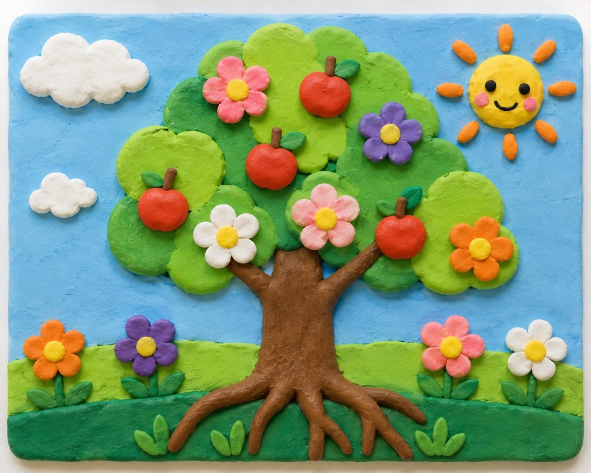
**小二範例**——在生命樹下加上「支撐我的家人」具象人物，畫面更完整地說出「我是被很多愛圍繞著」。
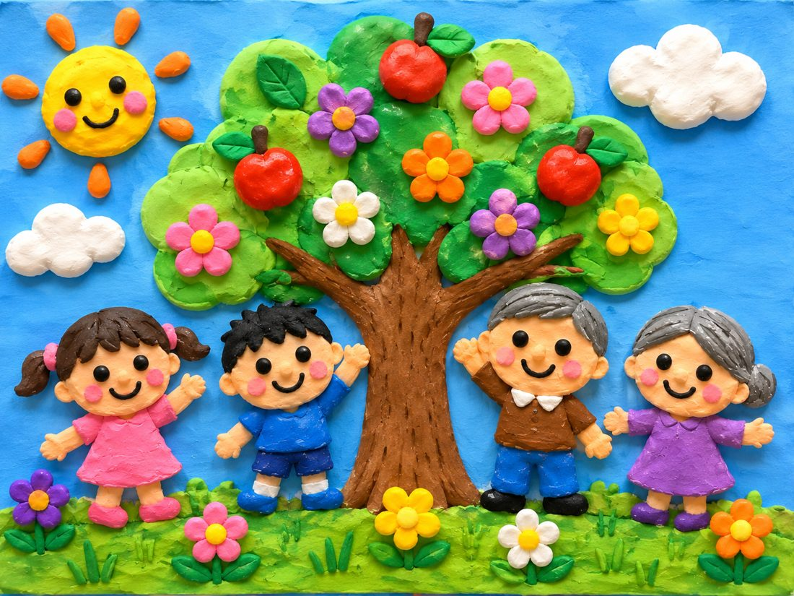

### 生命連結
**【統整・感恩・夢想・生命的圓滿】** 一棵樹有看不見的根、穩穩的幹、向上的枝、開花結果。這是 16 週的總結：**我從哪裡來、我靠誰支撐、我想長成什麼樣子**。

### 第 1 堂（上課 100 分＋整理 20 分）｜畫出我的樹
- **① 心靈登陸**：回顧前 7 件作品的照片牆——「這 16 週，你最喜歡哪一件？你長大了什麼？」
- **② 技法魔法**：示範畫 / 拼貼一棵大樹的根、幹、枝。
- **③ 沉浸創作**：
  - **根**（拼貼）：寫 / 貼上「支撐我的人」（家人、老師、朋友）。
  - **幹 / 枝**（繪畫）：畫出主幹。
- **④ 收心分享**：「你的根上有誰？」

### 第 2 堂（上課 100 分＋整理 20 分）｜開花、結果、許願
- **葉與花**（押花）：貼上押花當樹葉、花朵——「我擁有的美好」。
- **果實**（紙黏土）：捏小果實，每顆寫一個「我的夢想 / 我想成為的人」。
- **總結儀式**：每個孩子介紹自己的生命樹，老師頒「生命花園小園丁」證書。

### 💡 講師深度備忘錄
- **觀察重點**：根的部分孩子寫了誰？果實（夢想）是務實還是天馬行空？都珍貴。
- **對話引導**：「這棵樹再過 10 年會長成什麼樣子？那時候的你在做什麼？」
- **生命提醒**：總結不在於作品多完美，而在於孩子能說出「我是被很多愛支撐著長大的」。
- **展覽建議**：把 8 件作品一起佈展成「生命花園」，邀請家長來看，讓孩子當小小導覽員。

#### 📦 教學包補充
- **材料（每人）**：4 開厚卡、顏料／蠟筆、色紙（樹根）、押花（葉與花）、紙黏土（果實）、白膠、簽字筆、掛繩或緞帶。**共用**：前 7 件作品照片牆、「生命花園小園丁」證書（老師預製）。
- **作品存放與跨週銜接**：混媒、體積較大，第 1 堂根幹完成後平放陰乾；第 2 堂加花、果與許願，**作為成果展主視覺**集中佈展。
- **回家對話小卡**：「你的生命樹『根』上有誰在支撐你？樹上的『果實』寫了什麼夢想？」
- **總結儀式**：完成後逐一上台介紹生命樹，老師頒「生命花園小園丁」證書，為 16 週畫下圓滿句點。

---

## 六、教學通則與注意事項（小一、小二專用）

### 安全
- 所有媒材選**無毒、符合 CNS / 歐盟安全標章**；紙黏土選好搓不黏手款。
- 鈕扣、緞帶、押花等小物注意**誤食 / 過敏**；護貝、剪裁由老師協助。
- 顏料區鋪桌墊、備圍裙與濕紙巾，建立「弄髒沒關係、會收拾」的安心氛圍。

### 專注力與班級經營
- 單一活動 ≤ 20 分鐘，中間安排「動一動」伸展，避免久坐失焦。
- 用「魔法口令 / 收心鈴」做段落切換，孩子知道「要換下一件事了」。
- 示範時**誇張、好玩、步驟少**；口訣化（如「搓搓搓、壓壓壓」）。

### 評量（不打分數，重歷程）
- 以**歷程檔案**記錄：每件作品拍照 + 老師一句觀察 + 孩子一句話。
- 評量焦點：是否投入、是否願意分享、是否在過程中有「我做得到」的時刻。

### 親師延伸
- 每件作品附一張「**回家對話小卡**」，給家長一個問句（如：「請孩子介紹他的生命樹」），把生命教育延伸回家庭。

---

## 七、總材料清單（16 週）

| 類別 | 品項 |
|---|---|
| 繪畫 | 蠟筆、廣告顏料 / 水彩、水彩筆、調色盤、圖畫紙 / 厚卡紙、書籤卡 |
| 紙黏土 | 無毒輕質紙黏土（多色）、黏土工具組、牙籤、白膠 |
| 押花 | 各式押花 / 押葉（事先壓製或現場壓製）、鑷子、護貝膜 / 透明膠膜、緞帶 |
| 拼貼 | 色紙、雜誌 / 廣告紙、安全剪刀、口紅膠 / 白膠 |
| 裝飾 | 鈕扣、小布料、亮片、麻繩、小木牌 |
| 環境 | 桌墊、圍裙、濕紙巾、陰乾架、展覽用展板 |

---

## 附錄 A｜16 週學期行事曆與行前重點

> 「★」＝該堂有作品需**陰乾跨週**，下週才能接續；「☂」＝需備天氣／場地替代方案。

| 週次 | 進度 | 講師行前重點 |
|---|---|---|
| **開課前 2–3 週** | 採購、壓製押花、教室佈置 | 押花至少提前 2–3 週壓製；採買清單見附錄 D；佈置作品陰乾區 |
| W1 | 作品 1-1 我的魔法小宇宙（畫星球） | 備濕畫底紙、圓形描板；資料夾貼名字 |
| W2 | 作品 1-2（點星完成） | 備白色點筆／牙刷噴點 |
| W3 ★ | 作品 2-1 種子寶寶的家（塑形）→陰乾 | 預留陰乾盤；提醒「下週才上色」 |
| W4 | 作品 2-2（乾刷上色＋押花） | 確認上週作品已乾 |
| W5 | 作品 3-1 手牽手好朋友（撕貼） | 備多色色紙、底紙 |
| W6 | 作品 3-2（合作友誼鏈） | 備長條壁報；規劃貼牆位置 |
| W7 ★ | 作品 4-1 溫暖小屋（結構）→陰乾 | 備紙盒底板；陰乾托盤要穩 |
| W8 | 作品 4-2（上色佈置） | ⚠️ 熱熔槍僅老師操作 |
| W9 ☂ | 作品 5-1 大自然書籤（尋寶／壓花） | 勘查戶外場地；雨天改用現成押花 |
| W10 | 作品 5-2（排花、護貝、穿緞帶） | 備護貝膜、打孔器、緞帶 |
| W11 ★ | 作品 6-1 海底好朋友（畫背景）→陰乾 | 背景裱厚卡；黏土生物另盤陰乾 |
| W12 | 作品 6-2（上色組合＋環保宣言） | 備泡棉膠、吹風機 |
| W13 | 作品 7-1 毛毛蟲與繭 | 備圓形色紙、棉花 |
| W14 | 作品 7-2 破繭成蝶（押花翅膀） | 備押花、墊板；完成後平放 |
| W15 ★ | 作品 8-1 生命樹（根、幹）→陰乾 | 準備前 7 件作品照片牆 |
| W16 | 作品 8-2（花、果、許願）＋**成果展＋頒證** | 預製證書；佈展與邀請家長 |

---

## 附錄 B｜講師每堂行前準備清單（通用）

**前一天**
- [ ] 確認本堂材料數量（依出席人數＋2 份備用）
- [ ] 確認上週需陰乾的作品已乾、可接續
- [ ] 預讀本堂「生命連結」與對話引導語，準備暖身故事／影片
- [ ] 預做一份「示範樣品」讓孩子有參考

**當天上課前**
- [ ] 鋪桌墊、分材料、備濕紙巾與洗手動線
- [ ] 寫好今日流程於白板（孩子知道接下來會發生什麼）
- [ ] 陰乾區、作品歸位區貼好班級／姓名標籤

**課後（含最後 20 分鐘整理）**
- [ ] 帶孩子一起收拾、清潔、作品歸位、洗手
- [ ] 拍照存檔（歷程檔案）＋寫一句觀察
- [ ] 需陰乾的作品放妥、標名字、置通風處
- [ ] 補充／預訂下週缺漏材料

---

## 附錄 C｜學習觀察與評量紀錄表（範本・不打分數）

> 每堂針對需要關注的孩子重點記錄即可，不必每人每項都填。評量重歷程與生命態度。

| 觀察向度 | 🌱 萌芽 | 🌿 成長 | 🌳 茁壯 |
|---|---|---|---|
| **投入度** | 需較多陪伴才開始 | 能專注完成 | 主動延伸、樂在其中 |
| **情緒表達** | 較少表達 | 能說出感受 | 能連結生命主題分享 |
| **同儕互動** | 多獨自進行 | 願意分享材料 | 主動協助、鼓勵他人 |
| **面對不完美** | 容易挫折、想放棄 | 能接受並繼續 | 能把「失誤」轉成創意 |

**個別紀錄欄**

| 姓名 | 作品 | 本堂亮點（一句話） | 需關注／後續 |
|---|---|---|---|
|  |  |  |  |
|  |  |  |  |

---

## 附錄 D｜採購總表與預算估算（以 15 人班、單位新台幣概估）

> 實際金額依品牌與通路浮動，僅供編列預算參考。

| 類別 | 主要品項 | 估算總價 |
|---|---|---|
| 紙黏土 | 無毒輕質紙黏土多色（作品 2、4、6、8 用）、工具組、白膠、牙籤 | 1,800–2,500 |
| 繪畫顏料 | 廣告顏料／水彩、蠟筆、水彩筆、調色盤、洗筆筒 | 1,500–2,200 |
| 紙張卡材 | 圖畫紙、水彩紙、厚卡、書籤卡、色紙、壁報紙 | 1,000–1,500 |
| 押花耗材 | 押花／押葉、鑷子、護貝（冷裱）膜、緞帶、壓花器 | 1,200–1,800 |
| 裝飾小物 | 鈕扣、小布、亮片、棉花、麻繩、小木牌 | 600–1,000 |
| 環境設備 | 桌墊、圍裙、濕紙巾、陰乾盤、熱熔槍／膠條、展板 | 1,500–2,500 |
| 收尾 | 「小園丁」證書列印、成果展佈置、相框／展示夾 | 800–1,500 |
| **合計（估）** |  | **約 8,400–13,000** |

> 每生平均材料成本約 **NT$560–870**（含展覽），可依此訂定學費或申請經費。

---

## 附錄 E｜期末成果展「生命花園」策展規劃（W16）

- **展覽主題**：把教室／走廊佈置成一座「生命花園」，依四階段分區呈現孩子的成長旅程。
- **動線設計**：
  1. **入口・人與自己**：魔法小宇宙＋種子寶寶的家（情緒與自我）
  2. **第二區・人與他人**：友誼鏈牆＋溫暖小屋（愛與歸屬）
  3. **第三區・人與自然**：書籤＋海底好朋友（感恩與責任）
  4. **終點・人與生命**：毛毛蟲變蝴蝶＋生命樹（蛻變與圓滿）
- **小小導覽員**：每個孩子向家長介紹自己最喜歡的一件作品與它的故事（口語表達＋自我肯定）。
- **互動設計**：設「給孩子的一句話」便利貼牆，邀家長寫鼓勵；播放 16 週創作花絮照片。
- **帶回家**：頒「生命花園小園丁」證書；作品裝袋，附「回家對話小卡」總集。

---

## 附錄 F｜給協同／代課老師的快速上手指南

- **三個核心原則**：① 手作優先、語言其次　② 沒有失敗的作品　③ 每件都能帶回家。
- **黃金回應句**：不評「美／醜、像／不像」，改問「**這裡是什麼感覺？你想說什麼故事？**」
- **固定節奏**：登陸 12′→示範 15′→創作 58′→分享 15′→整理 20′（共 120′）。
- **三個雷區**：① 不催「快一點」　② 不幫孩子「改漂亮」　③ 不公開比較孩子的作品。
- **遇到狀況**：孩子說「我不會／好醜／壞掉了」→ 先接住情緒，再把「失誤」轉成「獨一無二的痕跡」。

---

> 🌻 **一句話總結**：這 16 週，孩子不只帶走 8 件作品，更帶走一座「**屬於自己的生命花園**」——知道自己有光、會長大、被愛著，也能去愛人與這個世界。
